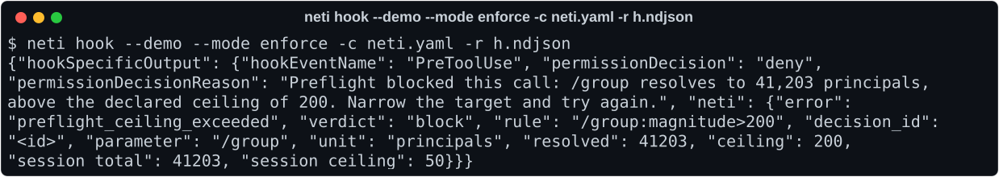
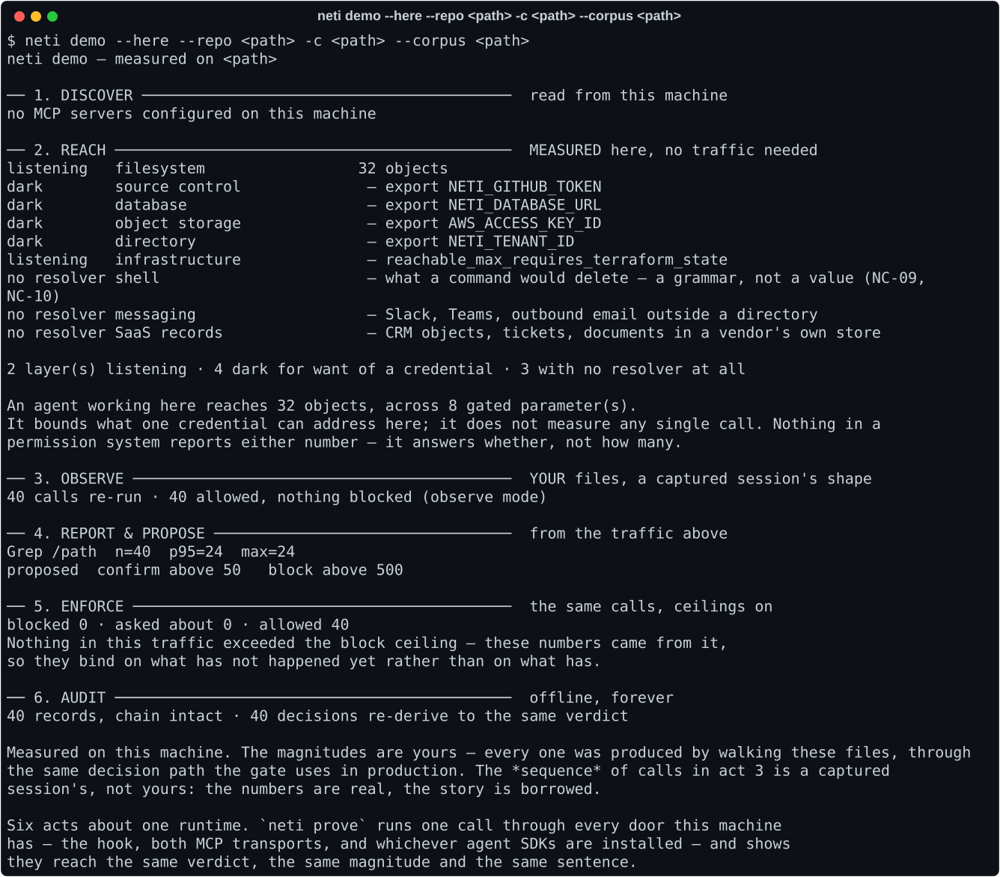
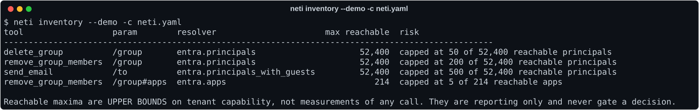
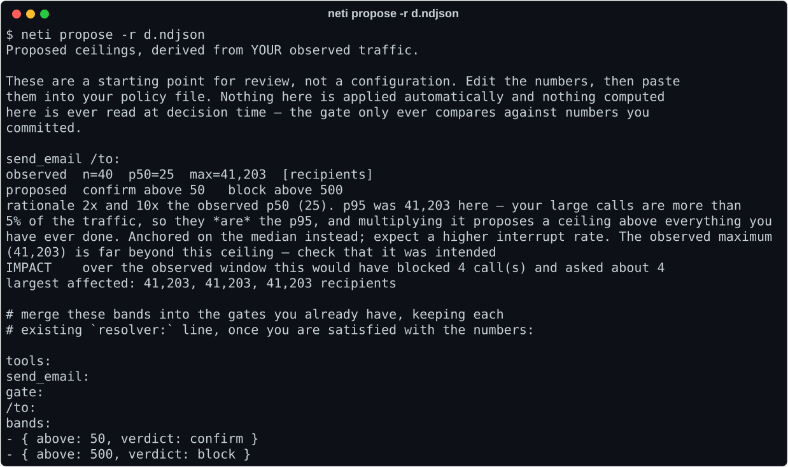
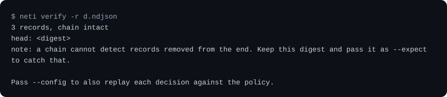

<h1 align="center">neti</h1>

<p align="center">
  <b>A preflight gate for agent tool calls.</b><br>
  Before an agent acts, <code>neti</code> resolves what the action will actually touch —<br>
  and blocks it when that is bigger than you said it should be.
</p>

<p align="center">
  <a href="https://github.com/Neti-Security/neti/actions/workflows/ci.yml"></a>
  
  
  
  
</p>

<p align="center">
  <b><a href="https://neti-security.github.io/neti/">neti-security.github.io/neti</a></b>
</p>

```
remove_group_members(group: "engineering-all")
```

Your policy engine sees a string on an allowlist. `neti` sees **412 people losing access to 9
applications** — and stops the call, because you declared a ceiling of 200.



The agent gets back a number, not a refusal — which is what makes it narrow the target and try again
instead of giving up or routing around. Nothing about the gate leaks into the prompt.

**Every image on this page is generated from a transcript the test suite pins byte for byte.** They
cannot show something the product no longer prints: change the wording and the build fails until the
picture is regenerated. See [`tools/make_media.py`](tools/make_media.py).

## Why

An agent asks to do one thing. That one thing turns out to be a million things. Nobody finds out
until after. Alignment, authorization, provenance, sandboxing, anomaly detection and rollback all
answer a different question; none of them answers *how big is this*.

## The first minute

```console
$ pip install "neti[all]"
```

`[all]` is everything one machine needs, which is the entire free tier; a bare install leaves a
`neti` command with no CLI behind it, and says so rather than failing obscurely.

That install is checked rather than asserted. [`tools/verify_install.py`](tools/verify_install.py)
builds a fresh virtualenv, installs the published wheel into it, generates a tree with a known file
count and walks this whole page — measure, gate, block, seal, tamper, verify, serve — asserting the
numbers. Run `just e2e` and watch twenty-two checks go green, or `just e2e --local` against a
checkout. Four defects in this project were only ever visible from outside the repository.

Then one command, in a repository you already have. It measures *this* machine — no credentials, no
config, no traffic to wait for.

```console
$ neti demo --here

── 2. REACH ────────────────────────────────────────────  MEASURED here, no traffic needed
   fs.paths                       35,871 objects
     bound by 8: Edit/file_path, Glob/pattern, Grep/path, Read/file_path, …

   An agent working here reaches 35,871 objects, across 8 gated parameter(s).
   It bounds what one credential can address here; it does not measure any single
   call. Nothing in a permission system reports either number — it answers
   whether, not how many.
```

Check it yourself with `find . \( -type f -o -type l \) | wc -l`. On a tree too large to walk it
reports `≥` and says the count stopped at its cap, because a cap presented as a total is a lie in
the flattering direction.

That is acts 1 and 2. Give it traffic — install the hook, work normally for an afternoon — and the
same command runs the rest: report, propose ceilings from what you actually did, enforce them
against the same calls, and verify the chain. `neti demo` without `--here` runs the identical
narrative against a synthetic tenant, and says so.



Six acts, one machine, no credentials: what an agent can reach here, what it actually did, the
ceilings that follow from it, the same calls re-run with those ceilings on, and a chain that
re-derives every verdict offline.

## Installing it

```console
$ neti install
Will write .claude/settings.json:   # merged into what is already there, and backed up
  Policy is in observe mode: nothing will be blocked, everything recorded.
```

Idempotent, and it refuses rather than guessing: settings it cannot parse are left alone, and a
policy that parses but cannot *construct* — a misspelled resolver, an unread provider key — is
rejected before it is wired in. That last one matters more than it looks: the hook catches its own
exceptions and exits 0, so a broken policy would leave every session working perfectly and nothing
ever gated.

## The first hour

Two commands, from a directory with nothing in it. No YAML to write, no traffic to wait for, and no
ceilings to guess at.

```console
$ neti init
Found 1 MCP server(s):
  entra    npx -y @acme/entra-mcp     (Claude Code (project))

Asking each one what tools it exposes…

  gated   delete_group           /group → entra.principals, /group#apps → entra.apps
  gated   remove_group_members   /group → entra.principals, /group#apps → entra.apps
  gated   send_email             /to → entra.principals
  ungated search_directory       nothing here can be sized

Wrote neti.yaml
  3 tool(s) gated, every ceiling left blank on purpose.
```

It reads the MCP client configs already on the machine, launches each server the way its client
does, asks `tools/list`, and writes a policy matching the tools it found. It declares **no ceilings**
— every band is empty and the mode is `observe`, so nothing can be blocked. Those numbers are meant
to arrive a week later out of your own traffic; a ceiling nobody chose is a ceiling nobody will
defend the first time it fires.

Then, still with no traffic:

```console
$ neti inventory
tool                  param        resolver          max reachable  risk
remove_group_members  /group       entra.principals         52,400  no ceiling declared — up to 52,400 principals in one call
send_email            /to          entra.principals         52,400  no ceiling declared — up to 52,400 principals in one call
remove_group_members  /group#apps  entra.apps                  214  no ceiling declared — up to 214 apps in one call

5 of 5 gated parameters have no ceiling declared. They resolve and record, but they cannot block.
```



That is the finding, on day one: *this agent holds a credential that can, in one call, reach 52,400
people and 214 applications, and nothing today would stop it.*

Add `--demo` to `neti inventory` or `neti gate` to run the whole path against a synthetic tenant with
no credentials at all — same engine, same records, only the numbers differ.

## Install

Three steps, no code change.

1. Register an Entra app and grant one permission — `GroupMember.Read.All`, Microsoft's documented
   least-privilege choice for the count endpoint. Admin-consent it.
2. `neti init`, then put the command it prints into your client's config.
3. Nothing else. Uninstall is reverting that one line.

The default mode is `observe`: a pass-through that resolves and records and **cannot block
anything**. The worst case of installing it is one hop.

## Putting it in front of an agent

No SDK, no code change, no redeploy — a config edit in the client you already use. The agent never
learns that the gate exists; it learns that a call was too big, which it already knows how to handle.

**An MCP server** (`.mcp.json`, `claude_desktop_config.json`, `~/.cursor/mcp.json`). Whatever command
launched the server becomes an argument to the gate:

```diff
   "entra": {
-    "command": "npx",
-    "args": ["-y", "@acme/entra-mcp"]
+    "command": "neti",
+    "args": ["gate", "--stdio", "--", "npx", "-y", "@acme/entra-mcp"]
   }
```

**The harness's own built-in tools**, which no proxy can see. Claude Code's `PreToolUse` hook is the
only seam that exists for those, and its contract maps onto the verdict lattice directly —
BLOCK → `deny`, CONFIRM → `ask`, and a pass says *nothing at all*, so the permission rules you
already configured keep working exactly as they were. In `.claude/settings.json`:

```json
{"hooks": {"PreToolUse": [{"matcher": "*",
  "hooks": [{"type": "command", "command": "neti hook"}]}]}}
```

**An agent SDK.** Each has one place where a request becomes an execution, and each adapter sits at
that place — so a blocked call comes back to the model as a tool *result* with the number in it,
never as an exception that kills the run:

```python
from neti.adapters.anthropic_tools import gate_tools     # Anthropic tool_runner
from neti.adapters.openai_agents  import neti_guardrail  # OpenAI Agents SDK
from neti.adapters.langchain_tools import gate_tools     # LangChain + LangGraph
from neti.adapters.pydantic_ai    import neti_hooks      # Pydantic AI
from neti.adapters.google_adk     import neti_plugin     # Google ADK
from neti.adapters.autogen_tools  import gate_workbench  # AutoGen
from neti.adapters.crewai_hooks   import gate_tools      # CrewAI
from neti.adapters.llamaindex_tools import gate_tools    # LlamaIndex
from neti.adapters.smolagents_tools import gate_tools    # smolagents
from neti.adapters.semantic_kernel_filters import neti_filter  # Semantic Kernel

runner = client.beta.messages.tool_runner(tools=gate_tools(pf, TOOLS), ...)
agent  = create_react_agent(model, gate_tools(pf, TOOLS))          # LangGraph
agent  = Agent("anthropic:claude-opus-4-5", capabilities=[neti_hooks(pf)])   # Pydantic AI
app    = App(name="ops", root_agent=agent, plugins=[neti_plugin(pf)])        # ADK
```

Four of the ten need nothing wrapped: ADK, Pydantic AI, OpenAI Agents and Semantic Kernel each have
a callback or filter the gate attaches to. The other six wrap the one method that executes, and
copy name, description and schema across verbatim — an agent must not be able to tell a gated tool
from an ungated one by looking at it, or the gate leaks into the prompt and into what the model
believes it may attempt. One `neti.yaml` governs a tool whichever runtime it arrives through,
because names are normalised the same way everywhere.

Two of these are less obvious than they look, and the adapters say so where they live. CrewAI has a
`before_tool_call` hook that can block a call, and it is *not* the seam: CrewAI substitutes a fixed
"blocked by hook" string for the reason and returns immediately, so the number never reaches the
model and no after-hook runs to put it back. The tool gets wrapped instead. AutoGen has no
before-tool callback at all, so it is the workbench that gets wrapped.

They agree. `tests/e2e/test_seam_equivalence.py` drives all twelve seams — including `neti gate` and
the hook — across all five resolver families, and asserts the same verdict, the same magnitude and
the same denial sentence byte for byte. A verdict that depends on which door a call came through is
a bug in the product, not in the adapter.

`neti prove` runs that same comparison on your machine, against whatever is installed, and hands you
the chain to re-check.

### Run the framework the way you run it, with no model at all

The seam table proves each adapter honours its framework's contract. It does that by calling the
integration point directly, which leaves a different question open: *when the framework executes
the tool its own way, is the gate in the path?* `just conformance` answers it by building a real
agent in each installed framework and running it.

**None of these rows has a model.** Each one scripts the response — a hand-written message, a fake
chat model, a mock HTTP transport — because that is what shows the gate is at the execution seam:
the model chooses *what* to call, and the gate decides *whether it runs*. No key, no network, no
provider, no cost, and the same answer every time, so it runs in CI on every push.

<!-- BEGIN CONFORMANCE -->

| runtime | version | what was driven | depth | |
|---|---|---|---|---|
| `anthropic` | 0.120.2 | the Anthropic tool_runner, read off the wire | full agent loop | driven |
| `autogen` | 0.7.5 | AutoGen AssistantAgent.run over a workbench | full agent loop | driven |
| `crewai` | 1.6.1 | a real Crew.kickoff, read from the agent's observation | full agent loop | driven |
| `google-adk` | 2.6.1 | an ADK App run by InMemoryRunner | full agent loop | driven |
| `langchain` | 1.3.14 | langchain.agents.create_agent, via the model interface | full agent loop | driven |
| `langgraph` | 1.2.10 | a compiled StateGraph executing a ToolNode | full agent loop | driven |
| `openai-agents` | 0.19.2 | the OpenAI Agents SDK Runner | full agent loop | driven |
| `pydantic-ai` | 2.22.0 | a Pydantic AI Agent over FunctionModel | full agent loop | driven |

<!-- END CONFORMANCE -->

Each row asserts the tool body never executed, that the sentence the agent was shown is byte-for-
byte what `Preflight` produced, and that the decision was sealed. Versions are recorded, because
"works with LangChain" is a sentence that outlives the version it was true of.

It earns its keep. The CrewAI row above is the reason CrewAI's gate is a wrapped tool: driving the
hook pair by hand reported a perfect denial, and running `Crew.kickoff()` showed the agent being
handed `Tool execution blocked by hook. Tool: Glob` with no number in it at all.

### Which runtime is yours

`neti score` prints the full list. The short version: twelve runtimes have an adapter here, and
everything that speaks **MCP** — Cursor, Claude Desktop, Windsurf, Cline, Continue, VS Code, Zed,
Goose, Strands, OpenAI's Codex CLI, OpenClaw — is reached without neti knowing they exist, because
the gate goes in front of the MCP server and whatever launched it launches `neti gate` instead.

Those two claims are not equally strong and the card keeps them apart. An adapter row was *driven*
by the seam table. An MCP client is *reached*: `tests/e2e/test_real_mcp_client.py` connects the
official SDK's own client to `neti gate` over a real pipe and watches an oversized call refused —
so the protocol is tested at the version those clients ship, and that Cursor speaks it is a fact
about Cursor rather than something claimed here.

What it does not reach, also on the card: an agent whose tools are in-process functions in a
language this package cannot wrap and which does not go through MCP — a Vercel AI SDK or Mastra app
with locally-defined TypeScript tools — and hosted runtimes that execute tools server-side, where
there is no local seam to sit at.

**A tool loop you wrote yourself** — an Anthropic or OpenAI function-calling loop, anything that
speaks neither MCP nor a hook protocol. One substitution gates every tool in your dispatch table:

```python
from neti import Preflight
from neti.adapters.tool_loop import gate_tools

pf = Preflight.from_config("neti.yaml")
TOOLS = gate_tools(pf, TOOLS)  # once, at the top. The loop below is unchanged.

for block in message.content:
    if block.type == "tool_use":
        out = TOOLS[block.name](**block.input)
```

Wrapping the whole table rather than each call is the point: it makes forgetting an all-or-nothing
mistake instead of a per-tool one. `pf.dispatch(...)` gates a single call and `@pf.guard` a single
function, and both are still there — but both can be forgotten for one tool out of five, and
nothing would say so.

`dispatch` returns the tool's own return value when the call fits and the denial *sentence* when it
does not, because your next line hands that string back to the model — and reading a specific number
is what makes it retry with a narrower scope instead of giving up. `pf.check(...)` and `@pf.guard`
are the same decision in the other two shapes. This is the one seam you can forget to use, and
nothing detects the omission; the other two cannot be bypassed that way, which is why they come
first.

**A remote MCP server**: `neti gate --upstream https://mcp.internal/rpc`, then point the client at
the gate instead.

Add `--demo` to either command to rehearse the whole thing against the synthetic tenant with no
credentials at all. Same engine, same decision procedure, same records — only the numbers differ.

## The first week

```console
$ neti report --since 7d
send_email /to        n=1,284   p50=3   p95=41   p99=112   max=8,900
  ▸ 4 calls exceeded 500 recipients

$ neti propose
send_email /to:  confirm above 150   block above 1,000     # 2× observed p99
```

You edit the numbers and commit them. `neti propose` is a config-authoring aid read by a human —
nothing learned ever reaches the decision path, so the gate stays a static integer comparison.



It shows its working, including when the statistics disagree with themselves: above, the p95 *is*
the outlier, so multiplying it would propose a ceiling above everything that has ever happened. It
anchors on the median instead and tells you to expect a higher interrupt rate. Then it prints what
those numbers would have done to the traffic you already have.

And the record it all came from re-derives, offline, forever:



`neti verify --config` goes further and replays each decision against the policy, so "the chain is
unbroken" becomes "and every verdict in it still follows from its evidence".

## What it costs to run

Measured against real Claude Code sessions, not modelled:

| | |
|---|---|
| Hook overhead, per tool call | **p50 ~140ms · p95 ~145ms**, and flat as the record file grows |
| Records | **~1.0–1.2 KB per call**, so roughly 1 MB per thousand |
| Decision itself | microseconds — the overhead above is almost entirely Python interpreter start |

"Flat" is the row that changed. `neti hook` used to read the entire record file twice per call —
once to seed the chain, once under the append lock — so the cost grew with everything you had
already recorded: **133ms fresh, 273ms at ten thousand records, 816ms at fifty thousand**, measured
on a lean install. The advice on this page is to run a week in observe mode, which is how you get to
fifty thousand. The head is cached in a `.head` sidecar now, keyed on the record file's byte length
so anything that touches the file outside the gate invalidates it and every reader falls back to the
full walk — it can fail to be *fast*, never to be right.

The record figure said ~700 bytes until somebody measured it again: a coding agent's calls against
`examples/coding-agent.yaml` write a median of 1,057 bytes with short relative paths, and 1,230 with
a realistic absolute one. Most of it is `causes` — the per-argument evidence that makes a verdict
re-derivable — and the `args` the call carried, so the number moves with how long your paths are.
`tests/property/test_docs_are_true.py` now measures it rather than trusting the table, because a
published number that drifts in the flattering direction is the kind of thing this project exists
not to do.

That last row is the one to act on. As a `PreToolUse` hook with `matcher: "*"`, neti starts a fresh
process for *every* tool call, and interpreter start dominates a sub-millisecond decision. If ~170ms
on every call is too much, narrow the matcher to the tools you actually gate:

```json
{"hooks": {"PreToolUse": [{"matcher": "Bash|Write|Edit",
  "hooks": [{"type": "command", "command": "neti hook"}]}]}}
```

The MCP paths do not pay this: `neti gate` is one long-lived process, so the decision is the
microseconds it measures.

**Concurrent agents are safe.** Claude Code runs tool calls in parallel and each hook invocation is
its own process, so several writers can reach the record file at once. Appends take an exclusive
lock and re-read the chain head under it — many processes, one file, no forked chain. There is a
test that runs eight real subprocesses and asserts exactly that, because a single-writer test cannot
see this and an earlier version of the sink forked the chain the first time a real agent ran two
tools at once.

## When a `confirm` needs an actual human

A `confirm` band means *somebody other than the agent's operator should decide this one*. On one
machine there is nobody to ask, so the gate stops the call and says so. That is correct, and it is
what a free install will keep doing.

The hosted tier — [`neti-cloud`](https://neti-security.github.io/neti/), BUSL-1.1 — is the somewhere the
question can go:

```console
$ neti-cloud serve --key $KEY                        # the control plane
$ neti login --url http://localhost:8730 --key $KEY  # on the agent's machine
$ neti gate --stdio --org -- npx -y @acme/entra-mcp  # in front of an MCP server
$ neti hook --org                                    # or Claude Code's built-in tools
```

The agent's call stops with *"approval a_b271… is pending; retry this exact call once it is
granted."* A reviewer opens the console and sees **500 recipients**, above a ceiling of 50, and
approves. The agent's retry proceeds. The grant is bound to that exact call under that exact policy,
is single-use, expires, and is refused if the target has grown since a human looked at it.

**If the control plane is unreachable, absent, or unpaid, the gate behaves exactly as the free
tier.** A control plane can only ever make a decision *more* permissive, and only through a named
human — so nothing about paying adds availability risk to enforcement. That is a test, not a promise.

| Free — Apache-2.0, this repository | Hosted — BUSL-1.1, a separate one |
|---|---|
| the engine, **all twelve seams**, observe **and enforce** | a second human approving a `confirm` |
| `init` · `inventory` · `report` · `propose` · `verify` · `prove` · `score` | org policy, one version across the fleet |
| the record chain, and replaying it with `neti verify --config` | session budgets that survive a restart |
| the console, every screen | audit across every agent |
| the detection rule table, and every resolver | the reviewed detection catalogue |

The rule is *"can one machine do this?"* — which is why enforcement is free and why every hosted
feature is a hole [SCOPE.md](SCOPE.md) already documents, or work that only exists because more than
one person did it. See [LICENSING.md](LICENSING.md).

**The client for the control plane is in this repository, under Apache-2.0**, along with the tests
pinning every property a grant is allowed to have: bound to one call, single-use, expiring, refused
if the target has grown since a human looked at it. Read the protocol, write your own server, hold it
to the same tests. What the hosted tier sells is a server that is running, not a secret about how to
talk to it.

## What can be sized

A seam without a resolver is a place to write `allow`, so this list is the real measure of coverage.

| resolver | unit | one call resolves | cost |
|---|---|---|---|
| `fs.paths` | objects | a path, directory or glob | local walk, capped |
| `db.rows` | rows | `DELETE`/`UPDATE` → `select count(*)` | one scan |
| `storage.objects` | objects | `s3://bucket/prefix` | paginated list, capped |
| `github.repos` | repositories | `owner` → every repo in the org | one request |
| `github.files` | objects | `owner/repo` → files on the default branch | one request |
| `entra.principals` | principals | a group → everyone in it, nested included | one `$count` |
| `entra.apps` | apps | a group → applications assigned to it | one `$count` |
| `entra.guests` | principals | a group → the external members only | one `$count` |
| `entra.principals_with_guests` | principals | the above, split internal/guest | two requests |
| `terraform.destroy` | resources | a plan file → what it would destroy | local read |

Two properties hold across all of them, and they are what the decision procedure rests on. **None
can return `0` for something it could not reach** — a failure is `UNRESOLVED` and routes through the
verdict you declared, because an unreachable target and an empty one are opposite situations with
the same number. And **anything capped or estimated reports a `LOWER_BOUND`**, which can block
soundly and can never allow — so the targets too large to count are exactly the ones that cannot
slip through quietly.

Sizing something else is ~80 lines against
[RESOLVER_CONTRACT.md](RESOLVER_CONTRACT.md), and it is the contribution that matters most.

## What it does not do

Read [SCOPE.md](SCOPE.md). It is short, it is honest, and the non-coverage list is numbered so tests
and write-ups can cite it. The headline: `neti` answers *how big*, not *whether this is a good idea*,
and a per-call gate cannot see 4,000 individual sends unless you declare a session budget.

## Documents

| file | what it fixes in place |
|---|---|
| [SCOPE.md](SCOPE.md) | what is and is not covered, and the sentences we do not say |
| [DECISION.md](DECISION.md) | the verdict lattice and the decision procedure, one page |
| [RESOLVER_CONTRACT.md](RESOLVER_CONTRACT.md) | the resolver spec — this is the actual product |

## Development

```console
just install          # uv pip install -e '.[dev,cli,graph,mcp,console,sdks,sdks-extended,storage,database]'
just test-all         # NETI_REQUIRE_SDKS=1 uv run pytest -q — what CI runs
uv run mypy
uv run ruff check
```

Install the extras. Without them the Anthropic, OpenAI Agents, LangChain and LangGraph tests
`importorskip` and vanish into a skip count, which is indistinguishable from a pass — that is how
three runtimes went untested through a green build for a release. `NETI_REQUIRE_SDKS=1` turns those
skips back into failures, and `tests/e2e/test_no_silent_skips.py` keeps the CI install line honest.

The suite has four tiers:

| | |
|---|---|
| `tests/property/` | executable invariants over the whole codebase — determinism, purity, direction soundness, the docs being true |
| `tests/integration/` | each component against its own seam |
| `tests/e2e/` | the product: all eleven seams agreeing across every resolver family, the operator's first week as one flow, every resolver through record and report, and `neti gate --stdio` in front of a real MCP server |
| `tests/live/` | real providers, opt-in |

`tests/live/` is skipped unless you give it something real to talk to. It is worth running: every
defect it has ever found was invisible to the offline suite, because an offline test asserts what
happens *given* a shape and only a live one tells you the shape is real. Most of it needs no cloud
account at all — Postgres and MinIO in Docker, and Terraform's `null` provider:

```console
just live-up && just live      # Postgres, S3 via MinIO, Terraform, and GitHub if `gh` has a token
just live-down                 # removes both containers
```

`neti check` is the Entra half, and the one thing here that still needs a tenant. It answers the
tenant-side questions the scorecard lists as unverified, needs an app registration with
`GroupMember.Read.All` (application permission, admin-consented), and is read-only throughout.

```console
NETI_TENANT_ID=… NETI_CLIENT_ID=… NETI_CLIENT_SECRET=… uv run neti check
```

Two of those tiers exist because this pass added them, and both found defects immediately:
`db.rows` had never once run through `psycopg` — thirty-nine tests, all against stdlib sqlite — and
was holding a connection it never closed; `storage.objects`'s pagination loop had never seen a
server that paginates. `boto3` and `psycopg` were not even installed in a working checkout, because
nothing needed them.

### Field trials

`eval/` is the tier above `tests/live/`: real agents and real servers, run by hand rather than by
CI, because it is non-deterministic and costs tokens. See [eval/README.md](eval/README.md).

```console
uv run python -m eval.surveys.mcp_coverage --markdown
```

That one is **M10**, and it used to be the least comfortable number in the project. Run against a
config carrying the MCP servers people actually install, `neti init` gated **0 of 160 discovered
tools** across the 13 that launch, because the matcher knew two parameter shapes and could therefore
only ever propose 2 of the 10 resolvers that exist. It is **25 of 160** now, against 34 that carry a
parameter a shipped resolver could size.

The remaining nine are not an oversight, and neither are the 135: `tests/corpus/` holds 170 real tool
schemas and a written judgement on every parameter of every one of them, including **401 parameters
no rule claims** and 41 the rule table declined *with a reason* — `query` on a search server is not
SQL, `repo` next to `owner` addresses one repository rather than the set of them. A gate that guesses
is worse than no gate, so the honest ceiling on a hand-written table is visible rather than hidden.
`neti score` prints the number, and prints it as absent when the survey has not been run.

### Asking your own model about the rest

`neti suggest` takes those 401 unclaimed parameters to a model, using **your** key from your shell.
neti never proxies the request and never sees the answer: `assist_client.py` is the only module that
opens a socket, it constructs the SDK with no `base_url`, and a property test asserts it names no
host but your provider and that `import neti` never loads it at all.

```console
$ neti suggest --dry-run     # prints exactly what would be sent, and sends nothing
$ neti suggest               # asks, and writes neti.suggested.yaml
```

**Or point it at a model on your own machine, and nothing leaves it at all:**

```console
$ neti suggest --provider local --model qwen2.5:32b
```

Any OpenAI-compatible runner — Ollama, LM Studio, llama.cpp, vLLM — with `--base-url` if it is not
Ollama's default. No key, no account, no third party, and **no extra to install**: the local client
is stdlib only, because reaching for an SDK to talk to a process on your own machine is a dependency
for nothing. The default address is loopback and a test asserts it, so the only way schemas leave
this machine is somebody typing an address.

What comes back is a **commented-out** fragment in a file `neti gate` never loads, with every band
empty. Deleting the `#` is your confirmation, and even then a merged suggestion resolves and records
without being able to block anything. It never edits your policy.

Four things make a wrong answer harmless rather than merely unlikely. The model is never asked for a
quantity — the response schema has nowhere to put a magnitude, a direction, a unit or a ceiling. The
resolver list is a closed enum derived from the rule table. The 41 parameters the rule table already
declined *with a written reason* are excluded when the batch is built, so the command structurally
cannot ask a model to overturn a judgement somebody already made. And it is scored: `just assist`
measures it against the committed answer key and reports what the model got **wrong** before what it
got right. `SCOPE.md` carries the one contamination path that does exist rather than hiding it.

**What it actually scored**, on a local 8B model, nothing leaving the machine:

| | |
|---|---|
| gates the rule table already makes | recovered **33 of 34**, zero wrong resolvers |
| parameters it declined *with a written reason* | claimed **19 of 41** — all wrong by construction, and never sent |
| the 401 no rule claims | **92** claims on things that are not sets, **7** gates genuinely found |

Both halves of that last row are the point. The seven are real: `filename` on seven browser tools
is a path on *this* machine, `fs.paths` ships and would answer it, and the rule table's name rule
simply does not know the word. It found every one that exists. It also cost ninety-nine wrong
claims to do it — roughly six percent of what it said was right.

That is why the output arrives commented out, with empty bands, in a file the gate never loads. A
suggestion here is a reading prompt, not an answer, and the number saying so is printed on `neti
score` rather than left for you to discover. The answer key for that last row is an opinion
([`eval/answers/adjudicate.py`](eval/answers/adjudicate.py)), written as rules with reasons so you
can disagree with it and see exactly which parameters move.

## Contributing

The highest-value contribution is **a resolver**: something that turns a tool's parameter into a
count. `tests/corpus/` names 401 parameters across 170 real tools that nothing here can size, and
some of them are sets somebody could measure — a Slack channel's members, the pages in a Notion
database, the rows a Linear filter matches.

It is about 80 lines against [RESOLVER_CONTRACT.md](RESOLVER_CONTRACT.md), which is short and is the
actual specification of the product. Two rules do most of the work: **never return `0` for something
you could not reach** — a failure is `UNRESOLVED`, because an unreachable target and an empty one are
opposite situations with the same number — and **anything capped or estimated reports a
`LOWER_BOUND`**, which can block soundly and can never allow.

Open an issue with the tool and the parameter and we will tell you honestly whether it can be sized.
[CONTRIBUTING.md](CONTRIBUTING.md) is the rest.

---

<p align="center">
  <a href="https://neti-security.github.io/neti/"><b>neti-security.github.io/neti</b></a> ·
  <a href="LICENSING.md">Apache-2.0</a> ·
  no telemetry, no phone-home, no licence check
</p>
